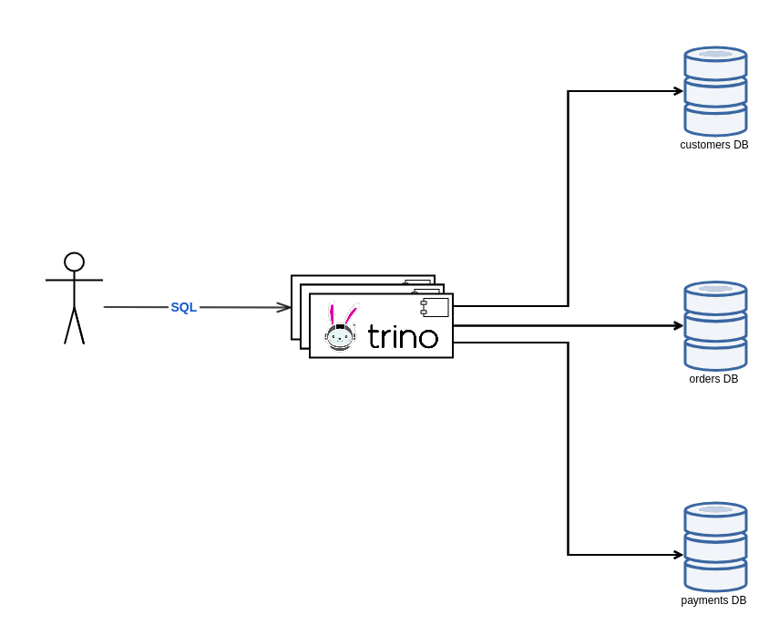

Trino in the data mesh
==============================

This project is inspired by the following two projects:

- [jaffle_shop](https://github.com/dbt-labs/jaffle_shop/) which is showcasing the functionality 
  of [dbt](https://www.getdbt.com/) data warehouse transformation  tool.
- [trino-dbt-demo](https://github.com/victorcouste/trino-dbt-demo) which showcases how to use `dbt` in a scenario where the 
  data to be transformed is found in several databases. See also the associated 
  [blog](https://medium.com/geekculture/trino-dbt-a-match-in-sql-heaven-1df2a3d12b5e) for this project. 


## Introduction

One frequently asked question in the context of using `dbt` tool is: 

> Can I connect my dbt project to two databases?

(see the answered [question](https://docs.getdbt.com/faqs/connecting-to-two-dbs-not-allowed) on the dbt website).

**tldr;** `dbt` stands for transformation as in `T` within `ELT`  pipelines, it doesn't move data from source to a warehouse.

The creators of the `dbt` tool however have added support for handling such scenarios via 
[dbt-presto](https://github.com/dbt-labs/dbt-presto) plugin.

The project [trino-dbt-demo](https://github.com/victorcouste/trino-dbt-demo) can be used as a primer in the context
of stitching together content from multiple databases over `dbt`.

[Trino](https://trino.io/) is a [fork](https://trino.io/blog/2020/12/27/announcing-trino.html) of the popular 
presto high performance, distributed SQL query engine for big data.
This SQL query engine offers a helping hand in performing SQL queries on top of a myriad of data sources.
Trino supports talking to the common relational databases (Postgres, MySQL) and also to data sources
that don't support SQL (AWS S3, Apache Kafka, Apache Cassandra, etc.). Feel free to check
the list of supported Trino [connectors](https://trino.io/docs/current/connector.html) for more details.

By using Trino/Presto, there can be queried data from fully separated databases. This makes Trino 
_the analytics engine for data mesh_ (quote from [Starburst](https://www.starburst.io/) website).


## jaffle shop data mesh

[Data Mesh](https://www.thoughtworks.com/radar/techniques/data-mesh) is a paradigm to the data engineering domain
which provides an alternative to the common recipe of using a centralized, monolithic data warehouse.

The principles on which this paradigm is being founded are quoted below:

- domain-oriented decentralization of data ownership and architecture 
- domain-oriented data served as a product 
- self-serve data infrastructure as a platform to enable autonomous, domain-oriented data teams 
- federated governance to enable ecosystems and interoperability. 

In the context of the project [jaffle_shop](https://github.com/dbt-labs/jaffle_shop/) there are being used
the domains:

- customers
- orders (customers make orders)
- payments (each completed order has a corresponding payment)

This project provides the answer to the questions answered by the project [jaffle_shop](https://github.com/dbt-labs/jaffle_shop/) 
(which was operating in the centralized data warehouse context) in a _data mesh_ decentralized data warehouse context 
where each domain (customer, order, payment) is being stored in a separate database.



By spinning up the [docker](https://www.docker.com/) environment:

```bash
docker-compose up
```

there will be started the following containers:

- `trino_jaffle_shop_paymentsdb_1`: contains the payments data in a Postgres database
- `trino_jaffle_shop_ordersdb_1`: contains the orders data in a Postgres database
- `trino_jaffle_shop_customersdb_1`: contains the customers data in a Postgres database
- `trino_jaffle_shop_trino_1`: contains corresponding catalogs for the tree databases mentioned previously

Once the containers are spinned up, there can be made interactions with Trino via Trino CLI:

```bash
docker exec -it trino_jaffle_shop_trino_1 /usr/bin/trino
```

The catalogs shown should correspond to the databases belonging to the jaffle shop domains:

```sql
trino> show catalogs;
   Catalog   
-------------
 customersdb 
 ordersdb    
 paymentsdb  
 system      
(4 rows)
```

Here are some basic queries performed on each of the database to make sure that
everything is running as expected:

```sql
trino> select count(*) from customersdb.public.customers;
 _col0 
-------
   100 
(1 row)

Query 20210703_204341_00001_pdadk, FINISHED, 1 node
Splits: 17 total, 17 done (100.00%)
0.32 [1 rows, 0B] [3 rows/s, 0B/s]

trino> select count(*) from ordersdb.public.orders;
 _col0 
-------
    99 
(1 row)

Query 20210703_204405_00002_pdadk, FINISHED, 1 node
Splits: 17 total, 17 done (100.00%)
0.22 [1 rows, 0B] [4 rows/s, 0B/s]

trino> select count(*) from paymentsdb.public.payments;
 _col0 
-------
   113 
(1 row)

Query 20210703_204420_00003_pdadk, FINISHED, 1 node
Splits: 17 total, 17 done (100.00%)
0.22 [1 rows, 0B] [4 rows/s, 0B/s]
```

Now that the access to each of the databases from Trino has been verified, 
the query corresponding to the [customers](https://github.com/dbt-labs/jaffle_shop/blob/main/models/customers.sql)
`dbt` model from the [jaffle_shop](https://github.com/dbt-labs/jaffle_shop/) project can be executed:


```sql
with customers as (

  select *
  from customersdb.public.customers
),
 orders as (
   select *
   from ordersdb.public.orders
 ),
 payments as (
   select *
   from paymentsdb.public.payments
 ),
 customer_orders as (
   select
     user_id,
     min(order_date) as first_order,
     max(order_date) as most_recent_order,
     count(id) as number_of_orders
   from orders
   group by 1
 ),
 customer_payments as (

   select
     orders.user_id,
     sum(amount) as total_amount

   from payments
          left join orders on payments.order_id = orders.id
   group by 1
 ),

 final as (

   select
     customers.id as customer_id,
     customers.first_name,
     customers.last_name,
     customer_orders.first_order,
     customer_orders.most_recent_order,
     customer_orders.number_of_orders,
     customer_payments.total_amount as customer_lifetime_value
   from customers
          left join customer_orders on customers.id = customer_orders.user_id
          left join customer_payments on customers.id = customer_payments.user_id
 )

select * from final
order by customer_id;
```

Here's a sneak peak of the results:

```sql
 customer_id | first_name | last_name | first_order | most_recent_order | number_of_orders | customer_lifetime_value 
-------------+------------+-----------+-------------+-------------------+------------------+-------------------------
           1 | Michael    | P.        | 2018-01-01  | 2018-02-10        |                2 |                    3300 
           2 | Shawn      | M.        | 2018-01-11  | 2018-01-11        |                1 |                    2300 
           3 | Kathleen   | P.        | 2018-01-02  | 2018-03-11        |                3 |                    6500 
           4 | Jimmy      | C.        | NULL        | NULL              |             NULL |                    NULL 
           5 | Katherine  | R.        | NULL        | NULL              |             NULL |                    NULL
```

Note in the previous query that the data corresponding to the domain models:

- customer
- order
- payment

is being joined transparently in order to provide insights across all the aforementioned domain models.

Even though this proof of concept project uses for simplicity a Postgres database to store the data for 
each of the domain models, there is a [myriad](https://trino.io/docs/current/connector.html) of other data sources 
that are supported on Trino and can be joined together.

Clean up the test environment by running the command:

```bash
docker-compose down
```


## Conclusion

This proof of concept project gives a quick demo on how to join and process data in the context of a
distributed _Data mesh_.  

Feel free to head over to [Trino](https://trino.io/) website and give it a try in case you may be dealing
with any of the scenarios:

- joining data from different data sources
- joining relational data with data found on AWS S3 (btw. AWS Athena is built on the same technology)

In case that the insights gained from analyzing the data mesh, need to be stored on a persistent storage
Trino does offer the ability to create tables. 
Note that the support for `MERGE` statements in still [in progress](https://github.com/trinodb/trino/issues/7708) in Trino.

For transformations requiring multiple steps it is worth taking into account the [dbt data transformation tool](https://www.getdbt.com/).


## Documentation

- [Data Mesh introductory article](https://martinfowler.com/articles/data-monolith-to-mesh.html)
- [Trino distributed query engine](https://trino.io/)
- [dbt tool](https://www.getdbt.com/)
